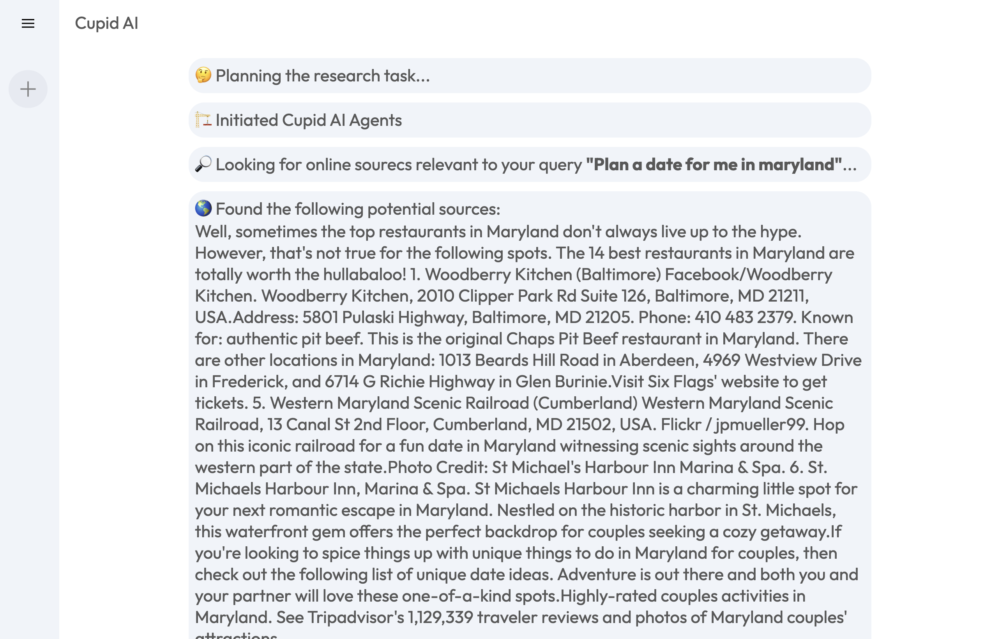

# Cupid-AI Date Planner

This project is an AI-based date planner that generates date plans based on user prompts. It uses LangGraph to orchestrate multiple OpenAI agents for generating plans and integrates with the Tavily API for additional research.

## Features

- Generates detailed date plans based on user prompts
- Integrates research suggestions to enhance date plans
- Provides critique and recommendations for improving date plans

## Setup

### Prerequisites
- Python 3.7 or higher
- pip (Python package installer)
- Node.js and npm (for front-end development)

### Installation

1. Clone the repository
2. Create and activate a virtual environment
    - Windows or Mac (template commands)
    - python -m venv venv or python3 -m venv venv
    - venv\Scripts\activate or source venv/bin/activate 
3. Install the required Python packages
    - pip install -r requirements.txt
4. Install the Node.js dependencies
    - cd client
    - npm install
    - cd ..

## Usage

### Running the Server
1. Run the Flask server
    - cd backend
    - python app.py or python3 app.py
    - cd ..
2. Run the Vite + React server
    - cd client
    - npm run dev
    - cd ..

### API Usage
- Endpoint: '/api/cupid-ai'
- Methods: 'GET', 'POST'
- Tavily API - Search engine built for AI Agents, used to retrieve data for dates
- OpenAI API - Generates initial date plans based on user prompts and revises itself

## Contribution
Contributions are welcome! Please fork the repository and create a pull request to contribute to this project.

## Architecture

1. **Frontend:**
   - **Framework:** React
   - **Build Tool:** Vite

2. **Backend:**
   - **Framework:** Flask
   - **Endpoints:** Provides RESTful APIs for interacting with the AI planner.
   - **Logic:**
     - **Task Handling:** Receives tasks from the frontend and processes them.
     - **State Management:** Manages the state of each task using LangGraph.
     - **Integration:** Interacts with the OpenAI API for generating plans and the Tavily API for additional research.

3. **AI Components:**
   - **LangGraph:** Orchestrates multiple OpenAI agents to generate and refine date plans.
   - **OpenAI API:** Generates initial date plans based on user prompts.
   - **Tavily API:** Provides additional research and information to enhance the date plans.

### Flow of Data

1. **User Interaction:**
   - The user interacts with the frontend to submit a date planning request.
   - The frontend sends this request to the backend via a RESTful API.

2. **Task Processing:**
   - The backend receives the request and initializes a new task.
   - The task is processed through various states using LangGraph:
     1. **Planner Node:** Generates an initial date plan using the OpenAI API.
     2. **Research Plan Node:** Enhances the plan with additional information from the Tavily API.
     3. **Generation Node:** Compiles the final date plan.
     4. **Reflection Node:** Provides critiques and suggestions for improvement.
     5. **Research Critique Node:** Refines the plan further based on critiques.

3. **Response:**
   - The processed date plan is sent back to the frontend.
   - The frontend displays the final plan to the user.

### Example Outcomes

### Improvements
1. Recent prompts or history to store previous prompts
2. React markdown for formatting the output response from the AI
3. Break out Main.jsx into seperate components for readability
4. Improve prompts for AI 
5. Human in the loop to adjust date plans as needed
